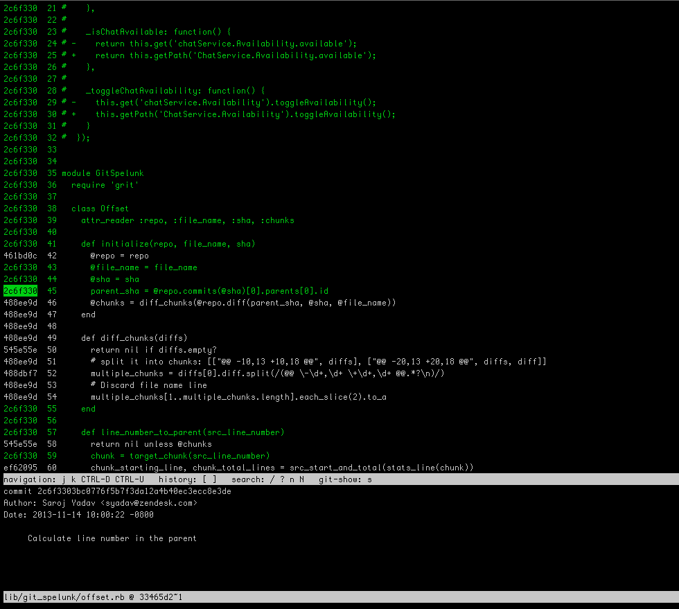

# git-spelunk

This is git-spelunk, an interactive tool for exploring blame history.

## Huh? 

`git blame` is a great tool for determining code responsibility.  But sometimes when you 
fire up git-blame, you'll find yourself in a loop of `git-blame`, `git-show`, and then 
`git-blame` again in order to find the true owner of a line of code.
`git-spelunk` is the tool for situations like this, when you want to 
skip past syntactic and refactoring commits to find the true owner of a line, or see how
a piece of source code has evolved over time.

## Guh?

It's easier to show you.

```
git spelunk lib/git_spelunk/offset.rb
```


You can see we've highlighted line 45.  `git-spelunk` here is telling us that this line was introduced
in commit 33465d2.  You can also see that all other lines that were involved in 33465d2 are picked out 
in green.  The output of `git show` is present as well for adding more context to the information.

Now we press '['.  What we're asking here is "show me the file just before 33465d2" was introduced, 
essentially replacing the content of the current screen with `git blame [file] 33465d2~1`.



There's other stuff to do; you can hit "s" to do a `git show` of the commit underneath the cursor, you 
can search and page through the file like you would with "less".


